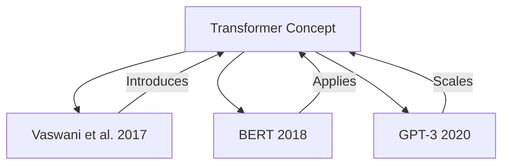

# LLM Wiki Skill

Pure skill implementation of [Karpathy's LLM Wiki pattern](https://gist.github.com/karpathy/442a6bf555914893e9891c11519de94f). No extension required—uses standard tools to maintain a structured, interlinked knowledge base.

## When to Use This Skill

- **Capturing sources**: URLs, papers, files, or text to add to knowledge base
- **Integrating knowledge**: Connecting source material into concept/entity/synthesis pages
- **Querying accumulated understanding**: Searching across all captured knowledge
- **Auditing wiki health**: Finding contradictions, orphans, or stale content
- **Bootstrapping**: Creating a new wiki vault with structure
- **Building persistent knowledge**: Long-term compounding understanding over time
- **Converting formats**: Between wiki formats (see converter skills)

## When NOT to Use This Skill

- **Simple Q&A**: Direct questions with clear answers — answer directly
- **Single-source capture**: Adding one simple URL without integration needs — use basic capture tools
- **Non-wiki content**: Content that doesn't benefit from persistent interlinked structure
- **Temporary notes**: Drafts or transient work better suited to scratch files
- **Personal journals**: Content not intended for shared knowledge base
- **Already-indexed sources**: Content already captured and indexed in the wiki
- **Automated scraping**: Bulk automated capture without curation or review
- **Format conversion only**: If only converting formats without content integration, use dedicated converter skills
- **Small datasets**: Content better managed with simpler tools

---

## Quick Start: First-Time Setup

### 1. Initialize Your Wiki

```bash
# Create wiki structure
mkdir -p ~/wiki/{sources,raw,meta,concepts,entities,synthesis,graph}
cd ~/wiki

# Copy template if available
if [ -f ~/.agents/skills/llm-wiki/templates/wiki-template.yaml ]; then
  cp ~/.agents/skills/llm-wiki/templates/wiki-template.yaml ~/wiki/wiki.yaml
fi

echo "Wiki initialized at ~/wiki"
```

### 2. Configure Your Wiki

Create `~/wiki/wiki.yaml`:

```yaml
name: "My LLM Wiki"
description: "Persistent knowledge base following Karpathy's pattern"
author: "Your Name"
created: "2026-04-23"
version: "1.0.0"

settings:
  source_format: "markdown"
  link_format: "wikilink"  # wikilink or markdown
  require_source_ids: true
  auto_tag: true
  max_file_size: "10MB"

folders:
  sources: "sources"
  raw: "raw"
  meta: "meta"
  concepts: "concepts"
  entities: "entities"
  synthesis: "synthesis"
  graph: "graph"

graph:
  enabled: true
  database: "graph/nodes.db"
  visualize: true
```

### 3. Add Your First Source

```bash
# Use the capture workflow
# See "Capturing Sources" section below
```

---

## Core Rules (Non-Negotiable)

1. **Never edit `raw/` directly** — sources are immutable after capture
2. **Never edit `meta/*` directly** — all metadata is generated
3. **Every source becomes a source page first** — before influencing canonical knowledge
4. **Search before creating** — use registry to find existing pages
5. **Cite with source IDs** — `[[sources/SRC-2026-04-04-001]]`
6. **Use folder-qualified wikilinks** — `[[concepts/retrieval-augmented-generation]]`
7. **Preserve uncertainty** — write tensions/caveats when evidence is mixed

---

## Capturing Sources: Step-by-Step

### Step 1: Determine Source Type

| Type | Examples | Storage Location |
|------|----------|------------------|
| **URL/Webpage** | Blog posts, docs, articles | `sources/url/` |
| **Paper/PDF** | Research papers, reports | `sources/pdf/` |
| **Book** | Physical or ebooks | `sources/book/` |
| **Code/Repo** | GitHub repos, snippets | `sources/code/` |
| **Video/Lecture** | Talks, tutorials | `sources/video/` |
| **Conversation** | Chat logs, interviews | `sources/conv/` |
| **File/Document** | Local files, reports | `sources/file/` |

### Step 2: Create Source Entry

**Template: `sources/[type]/[ID].md`**

```markdown
---
source_id: "SRC-2026-04-04-001"
type: "url"  # url, pdf, book, code, video, conv, file
title: "Attention Is All You Need"
author: "Vaswani et al."
date_published: "2017-06-12"
date_accessed: "2026-04-23"
tags: ["transformer", "attention", "nlp", "foundational"]
status: "active"  # active, deprecated, disputed, draft
quality: "high"  # high, medium, low
priority: 1  # 1-5, 1=highest
topics: ["transformer-architecture", "attention-mechanism"]
---

## Summary
One-paragraph summary of the source's key contribution.

## Key Points
- Point 1 with page/section reference
- Point 2 with context
- Point 3 with implications

## Notable Quotes
> "The dominant sequence transduction models are based on complex 
> recurrent or convolutional neural networks that include an encoder 
> and a decoder."
> — Section 1, Introduction

## Related To
- [[concepts/transformer-architecture]]
- [[entities/google-research]]
- Previous work: [[sources/SRC-2026-04-04-000]]

## Tensions & Caveats
- [ ] Later work showed attention can be more efficient
- [ ] Computational complexity O(n²) for long sequences

## Source Verification
- [x] PDF downloaded and stored
- [x] Key claims cross-referenced
- [ ] Code examples tested (N/A for paper)

## Raw Content Location
- Original: https://arxiv.org/abs/1706.03762
- Local: `raw/SRC-2026-04-04-001.pdf`
```

### Step 3: Store Raw Content

```bash
# Create raw content directory
mkdir -p raw/SRC-2026-04-04-001

# Save content with timestamp
wget -O raw/SRC-2026-04-04-001/original.html \
  "https://arxiv.org/abs/1706.03762"

# Create timestamp file
echo "Captured: $(date -Iseconds)" > raw/SRC-2026-04-04-001/timestamp.txt

# Generate checksum
sha256sum raw/SRC-2026-04-04-001/original.html > \
  raw/SRC-2026-04-04-001/checksum.sha256
```

### Step 4: Extract Key Information

```markdown
# File: meta/SRC-2026-04-04-001-extracted.md

## Extracted Concepts
- [[concepts/self-attention]]
- [[concepts/multi-head-attention]]
- [[concepts/positional-encoding]]

## Extracted Entities
- [[entities/vaswani]]
- [[entities/google-brain]]

## Key Claims
1. Attention mechanisms can replace recurrence
2. Parallel training enables scaling
3. Model achieves SOTA on translation tasks

## Evidence Quality
- Experimental results: ✅ (well-documented)
- Code available: ❌ (implementation came later)
- Replicated by others: ✅ (widely cited)
```

### Step 5: Update Search Index

```bash
# Simple search index
grep -r "attention" sources/ | \
  awk -F: '{print $1}' > \
  meta/search-index-attention.txt

# Full-text search
find sources/ -name "*.md" -exec \
  grep -l "transformer" {} \; > \
  meta/search-index-transformer.txt
```

---

## Knowledge Integration Workflow

### Pattern 1: Single Source → Concept Page

**When:** One high-quality source defines or expands a concept

1. Create/update source page (`sources/.../ID.md`)
2. Create concept page if it doesn't exist
3. Synthesize source into concept with clear attribution

**Example:**

`concepts/transformer-architecture.md`:

```markdown
---
title: "Transformer Architecture"
definition: "Neural network architecture using self-attention instead of recurrence"
first_defined: "Vaswani et al., 2017"
key_sources:
  - "[[sources/SRC-2026-04-04-001]]"  # Original paper
  - "[[sources/SRC-2026-04-04-050]]"  # Comprehensive survey
status: "well-established"
---

# Transformer Architecture

## Core Idea
Neural network architecture that uses self-attention mechanisms 
instead of recurrence or convolution for sequence transduction.

## Key Components

### Self-Attention Mechanism
- Allows each position to attend to all positions in previous layer
- Computes attention scores: `Attention(Q, K, V) = softmax(QK^T/√d_k)V`
- Captures dependencies regardless of distance

### Multi-Head Attention
- Projects queries, keys, values h times with different linear projections
- Allows model to jointly attend to information from different representation subspaces

### Positional Encoding
- Injects sequence order information
- Uses sine and cosine functions of different frequencies

## Why It Matters
1. **Parallelization**: Unlike RNNs, all positions computed simultaneously
2. **Long-range dependencies**: Direct connections between any two positions
3. **Scalability**: Performance improves with more data and compute

## Evolution
- 2017: Original Transformer (Vaswani et al.)
- 2018: BERT applies Transformer to language understanding
- 2020: GPT-3 scales Transformer to 175B parameters
- 2022+: Efficient attention variants reduce O(n²) complexity

## Open Problems
- Quadratic complexity for long sequences
- Interpretability of attention patterns
- Efficient training on very long contexts

## Source Relationships

```

### Pattern 2: Multiple Sources → Synthesis Page

**When:** Several sources provide different perspectives on the same topic

1. Gather all relevant sources
2. Create synthesis page comparing viewpoints
3. Highlight agreements/disagreements
4. Identify knowledge gaps

**Example:**

`synthesis/attention-mechanisms-comparison.md`:

```markdown
---
title: "Attention Mechanisms: Comparative Analysis"
topic: "attention"
sources_count: 5
status: "active"
last_updated: "2026-04-23"
---

# Attention Mechanisms: Comparative Analysis

## Overview
Comparison of attention mechanisms across 5 key papers, highlighting
differences in efficiency, expressiveness, and applications.

## Papers Compared
- [[sources/SRC-2026-04-04-001]]: Original Transformer (Vaswani et al.)
- [[sources/SRC-2026-04-04-100]]: Linformer (Wang et al.)
- [[sources/SRC-2026-04-04-101]]: Performer (Choromanski et al.)
- [[sources/SRC-2026-04-04-102]]: Longformer (Beltagy et al.)
- [[sources/SRC-2026-04-04-103]]: FlashAttention (Dao et al.)

## Comparison Matrix

| Mechanism | Complexity | Memory | Long Sequences | Parallelizable |
|-----------|-----------|---------|----------------|----------------|
| Standard Attention | O(n²) | O(n²) | ❌ Poor | ✅ Yes |
| Linformer | O(n) | O(n) | ✅ Good | ✅ Yes |
| Performer | O(n) | O(n) | ✅ Good | ✅ Yes |
| Longformer | O(n) | O(n) | ✅ Good | ✅ Limited |
| FlashAttention | O(n²) | O(n) | ❌ Poor | ✅ Yes |

## Key Findings

### Agreements
- All methods agree standard attention doesn't scale to very long sequences
- Linear attention methods trade some expressiveness for efficiency
- Memory, not compute, often the bottleneck

### Disagreements
- **Expressiveness**: Linformer shows linear attention loses information; 
  Performer claims kernel approximation preserves it
- **Implementation**: FlashAttention argues hardware-aware algorithms beat 
  algorithmic improvements for moderate sequences

### Knowledge Gaps
- [ ] No unified theory explaining when linear attention fails
- [ ] Limited empirical comparison on same tasks/architecture
- [ ] Sparse attention patterns not well understood theoretically

## Recommendations by Use Case

| Use Case | Best Choice | Why |
|----------|------------|-----|
| Short sequences (<512) | Standard | Simplicity, maximum expressiveness |
| Long documents (4K+) | Longformer | Sparse attention matches text structure |
| Very long (16K+) | Performer | Linear scaling, good approximation |
| Training efficiency | FlashAttention | Memory optimization, hardware-aware |
| Theoretical work | Standard | Best understood, clear baselines |

## Tensions & Open Questions

### Efficiency vs. Expressiveness Trade-off
All linear attention methods make approximation assumptions. When do these 
break down? No clear answer yet.

### Hardware vs. Algorithm
FlashAttention shows hardware-aware implementations can compete with 
better algorithms. Does this generalize to other contexts?

### Task-Specific Performance
Performance varies significantly by task. Need more standardized benchmarks.

## Citation Network

```
Vaswani 2017 (Original)
    │
    ├→ Beltagy 2020 (Longformer) ── Sparse patterns
    │
    ├→ Choromanski 2020 (Performer) ── Kernel methods
    │
    └→ Wang 2020 (Linformer) ── Low-rank projection
            │
            └→ Dao 2022 (FlashAttention) ── Hardware optimization
```

## Next Research Directions

Based on synthesis, promising directions:
1. Hybrid approaches (sparse + linear attention)
2. Task-specific attention patterns
3. Learning attention patterns from data
4. Hardware-algorithm co-design

## Action Items

- [ ] Run experiments comparing on same task
- [ ] Analyze attention patterns visually
- [ ] Test on extreme sequence lengths (64K+)
```

### Pattern 3: Entity Page

**When:** Tracking organizations, people, or projects across multiple sources

`entities/google-deepmind.md`:

```markdown
---
title: "Google DeepMind"
type: "organization"
founded: "2010"
headquarters: "London, UK"
key_people:
  - "Demis Hassabis (CEO)"
  - "Shane Legg (Co-founder)"
  - "Mustafa Suleyman (Co-founder, departed 2022)"
focus: ["AI research", "AGI", "reinforcement learning"]
sources:
  - "[[sources/SRC-2026-04-04-200]]"  # Company overview
  - "[[sources/SRC-2026-04-04-201]]"  # AlphaGo paper
status: "active"
---

# Google DeepMind

## Overview
AI research lab acquired by Google in 2014, focused on artificial 
general intelligence and reinforcement learning.

## Major Achievements

### AlphaGo (2016)
- First AI to defeat human world champion at Go
- Combined deep learning with Monte Carlo tree search
- [[sources/SRC-2026-04-04-201]]

### AlphaFold (2020)
- Protein structure prediction breakthrough
- 92% accuracy on CASP14
- Revolutionized structural biology
- [[sources/SRC-2026-04-04-202]]

### Gato (2022)
- Generalist agent across 604 tasks
- Single neural network for multiple modalities
- [[sources/SRC-2026-04-04-203]]

## Key People

| Person | Role | Notable Work |
|--------|------|--------------|
| Demis Hassabis | CEO | AlphaGo, AlphaFold |
| David Silver | Research Director | AlphaGo, AlphaZero |
| Nando de Freitas | Research Scientist | Gato, Scaling laws |

## Research Focus Areas

1. **Reinforcement Learning**: Agent learning and decision-making
2. **Deep Learning**: Neural network architectures
3. **Neuroscience**: Brain-inspired AI
4. **Protein Folding**: Computational biology

## Collaborations & Competition

### Collaborations
- Partnership with Moorfields Eye Hospital (medical AI)
- Academic partnerships (UCL, Oxford, Cambridge)

### Competition
- OpenAI (ChatGPT, GPT-4)
- Anthropic (Claude)
- Meta AI (LLaMA)

## Open Questions

- [ ] How will AGI development timeline change post-AlphaFold?
- [ ] Commercialization strategy vs. research focus?
- [ ] Impact of Google integration on research direction?

## Source Index

All sources mentioning Google DeepMind: 
```bash
grep -r "DeepMind" sources/ | cut -d: -f1 | sort -u
```
```

---

## Querying Your Wiki

### Method 1: Text Search

```bash
# Search all markdown files for a term
grep -r "attention" ~/wiki --include="*.md"

# Show context
grep -r -B2 -A2 "attention" ~/wiki --include="*.md"

# Count occurrences
grep -r -c "attention" ~/wiki --include="*.md" | \
  sort -t: -k2 -rn
```

### Method 2: Structured Search

```bash
# Find all sources about transformers
find ~/wiki/sources -name "*.md" -exec \
  grep -l "transformer" {} \;

# Find high-priority, unreviewed sources
find ~/wiki/sources -name "*.md" -exec \
  grep -l 'priority: [12]' {} \; | \
  while read f; do
    if ! grep -q 'status: "reviewed"' "$f"; then
      echo "$f"
    fi
  done
```

### Method 3: Graph Queries (if enabled)

```bash
# Find all concepts related to "attention"
python3 ~/wiki/graph/query.py --concept attention

# Find path between two concepts
python3 ~/wiki/graph/query.py --path "attention" "transformer"

# Most connected entities
python3 ~/wiki/graph/query.py --central
```

### Method 4: Using Existing Tools

```bash
# Use search_files tool
search_files "attention" --path ~/wiki --target content

# Find specific file types
search_files "*.md" --path ~/wiki/sources --target files
```

---

## Wiki Health Audit

Run periodic audits to maintain wiki quality:

### Weekly Checks

```bash
#!/bin/bash
# audit-weekly.sh

echo "=== Weekly Wiki Audit ==="
echo

# 1. Orphaned files (no incoming links)
echo "1. Orphaned pages:"
for f in $(find ~/wiki -name "*.md" -type f); do
  filename=$(basename "$f" .md)
  if ! grep -r "\[\[$filename" ~/wiki --include="*.md" | grep -v "$f"; then
    echo "   🔍 $f"
  fi
done
echo

# 2. Dead links (pointing to non-existent files)
echo "2. Dead links:"
grep -r "\[\[.*\]\]" ~/wiki --include="*.md" | \
  sed 's/.*\[\[\(.*\)\]\].*/\1/' | \
  while read link; do
    if [ ! -f "$HOME/wiki/$link.md" ] && 
       [ ! -f "$HOME/wiki/${link//\//\/}.md" ]; then
      echo "   🔴 $link"
    fi
  done
echo

# 3. Files without source attribution
echo "3. Pages without citations:"
find ~/wiki/concepts ~/wiki/entities ~/wiki/synthesis \
  -name "*.md" -type f | while read f; do
  if ! grep -q "\[\[sources/" "$f"; then
    echo "   ⚠️  $f"
  fi
done
echo

# 4. Stale files (not updated in 90+ days)
echo "4. Stale files (90+ days):"
find ~/wiki -name "*.md" -type f -mtime +90 | \
  while read f; do
    echo "   🕰 $f ($(find "$f" -mtime +90 -printf "%AY%Am"))"
  done
echo

# 5. Files with TODO/FIXME
echo "5. Files with TODO/FIXME:"
grep -r -l "TODO\|FIXME" ~/wiki --include="*.md"
echo

#  Contradictions check
echo "6. Potential contradictions (manual review needed):"
# Use your judgment to flag conflicting claims
# Example: grep for "however" or "but" near claim statements
```

### Monthly Checks

```bash
#!/bin/bash
# audit-monthly.sh

echo "=== Monthly Wiki Audit ==="
echo

# 1. Growth statistics
echo "1. Wiki Growth:"
echo "   Total files: $(find ~/wiki -name "*.md" | wc -l)"
echo "   Sources: $(find ~/wiki/sources -name "*.md" | wc -l)"
echo "   Concepts: $(find ~/wiki/concepts -name "*.md" | wc -l)"
echo "   Entities: $(find ~/wiki/entities -name "*.md" | wc -l)"
echo "   Synthesis: $(find ~/wiki/synthesis -name "*.md" | wc -l)"
echo

# 2. Source quality distribution
echo "2. Source Quality:"
echo "   High: $(grep -r 'quality: "high"' ~/wiki/sources | wc -l)"
echo "   Medium: $(grep -r 'quality: "medium"' ~/wiki/sources | wc -l)"
echo "   Low: $(grep -r 'quality: "low"' ~/wiki/sources | wc -l)"
echo

# 3. Tag cloud (most common tags)
echo "3. Most Common Tags:"
grep -r "tags:" ~/wiki/sources | \
  sed 's/.*\[//;s/\].*//;s/, /\n/g' | \
  sort | uniq -c | sort -rn | head -10
echo

# 4. Top referenced sources
echo "4. Most Referenced Sources:"
for f in $(find ~/wiki -name "*.md" -type f); do
  grep -o "\[\[sources/[A-Z0-9-]*\]\]" "$f" 2>/dev/null | \
    sed 's/\[\[sources\///;s/\]\]//'
done | sort | uniq -c | sort -rn | head -10
echo

# 5. Backlog size (draft files)
echo "5. Draft Files:"
find ~/wiki -name "*.md" -type f -exec \
  grep -l 'status: "draft"' {} \; | wc -l
echo
```

---

## Integration Examples

### With Other Skills

#### Using with `karpathy` Skill

After capturing sources, apply Karpathy guidelines:

```markdown
# Implementing Transformer from Scratch

## Pre-Implementation Checklist (Karpathy)
- [x] Can I state the problem in one sentence?
  > Build a minimal Transformer for character-level text generation
- [ ] Have I searched for similar code in the codebase?
  > Found [[concepts/transformer-implementation]] patterns
- [x] What's the simplest solution that works?
  > Start with single-head attention, no positional encoding

## Karpathy Anti-Patterns to Avoid

❌ **Over-engineering**: Don't build a full library
❌ **Silent errors**: Validate tensor shapes at every step
✅ **Surgical changes**: One component at a time

## Source References
- Implementation pattern: [[sources/SRC-2026-04-04-300]]
- Math details: [[sources/SRC-2026-04-04-001]]
```

#### Using with `convergence` Skill

When doing research investigations:

```markdown
# Research Update: Attention Mechanisms

**Triggered by:** User query about efficient attention
**Sub-methods:** Document parser, structural-parallel

## THREAD A: Linear Attention

**Finding:** Linear attention methods reduce complexity from 
O(n²) to O(n) but with expressiveness trade-offs.

### Significance
Enables processing of longer sequences (4K → 16K+ tokens)

### Graph actions
- Add node: "Linear Attention" [high]
- Add edge: "Linear Attention" --reduces--> "O(n²) quadratic"  
- Add edge: "Linear Attention" --trades--> "Expressiveness"

### TENSION SCORE: 0.78
High tension between efficiency gains and theoretical limitations.

## Candidate Findings (Medium Tier)
- [ ] FlashAttention may eliminate need for linear attention on GPUs
  - **Upgrade path**: Test FlashAttention on target hardware

## Apophenia Audit
- [x] Tier check: All claims labeled
- [x] Bridge-figure check: Authors identified
- [x] Chain check: Clear causal relationships
- [x] Counter-evidence: Considered standard attention benefits
- [x] Novelty check: Compared against prior art

### Source References
- Primary: [[sources/SRC-2026-04-04-100]]
- Comparison: [[sources/SRC-2026-04-04-101]]
- Hardware angle: [[sources/SRC-2026-04-04-103]]
```

#### Using with `systematic-debugging` Skill

When troubleshooting:

```markdown
# Debugging: Attention Outputs NaN

## Systematic Debugging Process

### Phase 1: Understand the Problem
NaN values in attention weights after 100 training steps

### Phase 2: Check Knowledge Base
Found similar issue: [[entities/attention-nan-issue]]

Relevant sources:
- [[sources/SRC-2026-04-04-001]]: Original paper (no mention)
- [[sources/SRC-2026-04-04-500]]: Practical implementation notes
  > "Check for large logits before softmax"

### Phase 3: Root Cause Analysis
Based on accumulated knowledge:
1. Large query/key dot products → large logits → softmax overflow
2. No scaling by √d_k (forgot from [[concepts/attention-scaling]])
3. Gradient explosion in training

### Phase 4: Fix
Added scaling factor as documented in [[sources/SRC-2026-04-04-001]]
```

---

## Best Practices

### Naming Conventions

| Type | Format | Example |
|------|--------|---------|
| Source ID | `SRC-YYYY-MM-DD-NNN` | `SRC-2026-04-04-001` |
| Concept | `kebab-case` | `transformer-architecture` |
| Entity | `kebab-case` | `google-deepmind` |
| Synthesis | `kebab-case` | `attention-comparison` |
| File | `Folder/name.md` | `concepts/attention.md` |

### Linking Strategy

**Always use folder-qualified links:**
- ✅ `[[concepts/transformer-architecture]]`
- ❌ `[[transformer-architecture]]` (ambiguous)

**For sources, use ID only:**
- ✅ `[[sources/SRC-2026-04-04-001]]`

**Cross-folder links:**
- ✅ `[[../concepts/from-entity]]` (relative)
- ✅ `[[concepts/absolute-path]]` (from root)

### Writing Style

- **Be concise**: One idea per paragraph
- **Attribute clearly**: Every claim should have a source
- **Note uncertainty**: Use "[TODO: verify]" or "[seems to]"
- **Update regularly**: Revisit pages quarterly
- **Link generously**: Cross-reference related concepts

### Maintenance

- **Weekly**: Add new sources, quick audit
- **Monthly**: Deep audit, tag review
- **Quarterly**: Major reorganization, prune stale content
- **Annually**: Full review, archive old projects

---

## Common Workflows

### Workflow 1: Literature Review

1. Capture all papers as sources
2. Create concept pages for key terms
3. Create synthesis page comparing papers
4. Build entity pages for key researchers
5. Generate citation network

### Workflow 2: Project Documentation

1. Capture project requirements as sources
2. Create entities for team members, tools
3. Create concepts for key technologies
4. Synthesis page for project decisions
5. Link to implementation files

### Workflow 3: Learning Path

1. Capture tutorials, courses as sources
2. Create concept pages for learned topics
3. Link concepts in dependency order
4. Track progress with status tags
5. Review periodically

### Workflow 4: Research Notes

1. Capture papers as you read
2. Extract key points to meta files
3. Update synthesis as understanding grows
4. Create hypothesis pages
5. Track validation status

---

## Tools & Automation

### Useful Scripts

```bash
#!/bin/bash
# create-source.sh - Quick source creation

TYPE=$1
TITLE=$2
DATE=$(date +%Y-%m-%d)
NUM=$(ls sources/$TYPE/*.md 2>/dev/null | wc -l | xargs printf "%03d")
ID="SRC-${DATE}-${NUM}"

cat > sources/$TYPE/${ID}.md << EOF
---
source_id: "${ID}"
type: "${TYPE}"
title: "${TITLE}"
date_accessed: "${DATE}"
tags: []
status: "draft"
---

## Summary

## Key Points

## Source Verification
- [ ] Content captured
- [ ] Key claims identified
- [ ] Related concepts extracted

EOF

echo "Created: sources/$TYPE/${ID}.md"
```

### Template Files

Store templates in `~/.agents/skills/llm-wiki/templates/`:

- `source-template.md` - Source page template
- `concept-template.md` - Concept page template
- `entity-template.md` - Entity page template
- `synthesis-template.md` - Synthesis page template

---

## Troubleshooting

### Issue: Too Many Orphaned Pages

**Cause**: Creating pages without linking them

**Fix**: 
- Always link new pages to existing wiki
- Run weekly orphan check
- Use graph visualization to find isolated nodes

### Issue: Contradictory Information

**Cause**: Multiple sources with conflicting claims

**Fix**:
- Create synthesis page comparing sources
- Note quality and reliability differences
- Flag for further investigation
- Use `[TODO: resolve]` tags

### Issue: Wiki Getting Messy

**Cause**: No regular maintenance

**Fix**:
- Set up weekly/monthly audit scripts
- Use consistent naming conventions
- Archive old projects to separate folder
- Regular pruning of stale content

### Issue: Hard to Find Information

**Cause**: Poor tagging or too many folders

**Fix**:
- Implement consistent tagging system
- Use fewer, broader folders
- Create index pages for major topics
- Use full-text search regularly

---

## Related Skills

### Conversion Skills

- `gh-wiki-to-llm-wiki-converter` - Convert GitHub wiki to LLM wiki format
- `llm-wiki-to-gh-wiki-converter` - Convert LLM wiki to GitHub wiki format

### Knowledge Management

- `gh-wiki` - GitHub Markdown wiki system
- `karpathy` - Coding quality guidelines for wiki content

### Research Skills

- `convergence` - Multi-source research investigation
- `context7-mcp` - Documentation fetching for technical topics

---

## Summary Checklist

Before marking a capture session complete:

- [ ] All sources created with proper metadata
- [ ] Raw content backed up
- [ ] Key concepts extracted to concept pages
- [ ] Entities identified and linked
- [ ] Contradictions or tensions noted
- [ ] Pages properly cross-linked
- [ ] Tags applied consistently
- [ ] Uncertainty flagged where present
- [ ] Wiki health check run (no orphans, no dead links)
- [ ] Graph updated (if using)

---

## Quick Start Command Reference

```bash
# Initialize wiki
mkdir -p ~/wiki/{sources,raw,meta,concepts,entities,synthesis,graph}

# Create source page
vim ~/wiki/sources/url/SRC-2026-04-04-001.md

# Search for topic
grep -r "topic" ~/wiki --include="*.md"

# Find related pages
grep -r "\[\[concept-name\]\]" ~/wiki --include="*.md"

# Audit wiki
./audit-weekly.sh

# Backup wiki
tar -czf wiki-backup-$(date +%Y%m%d).tar.gz ~/wiki
```